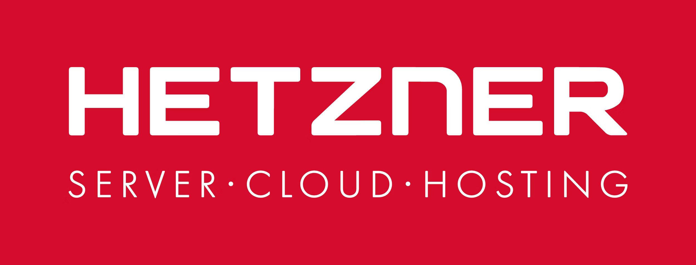

## Mon homelab

Pour que ce site puisse être accessible, il me fallait l'héberger pour le diffuser sur internet.  
Passioné par le hardware, je voulais d'abord acheter un vieux pc type Dell Optiplex ou HP Prodesk sur leboncoin, et le transformer en serveur personnel. Cependant, je voulais quelque chose dans ma région pour ne pas avoir à le faire livrer, de peur que le pc se casse. Malheureusement, il n'y a pas grand chose dans ma région. Je me suis donc rabbatu vers une autre option : __les VPS__.

Il existe de nombreux hébergeurs qui proposent des VPS pour des prix très abordable, du moins tant que l'usage que l'on fait n'est pas énorme. Dans mon cas, je voulais pouvoir hoster ce site de portfolio, <a href="https://peasy-money.fr" target="_blank" rel="noopener noreferrer">mon site de tracking de PEA</a> ainsi que de futurs projets web ou webapp. Je me suis donc tourné vers __Hetzner__. 

Hetzner est un hébergeur allemand qui propose tous types d'hébergements pour tous types de prix. Cela va du simple hébergement 2 coeurs avec 2 GB de ram et 40 GB de stockage pour 4€35 HT par mois, à 16 coeurs 32 GB de ram et 360 GB de stockage pour 54€90 HT par mois. Bien sur, il existe des options de serveurs dédié avec encore plus de configuration mais le prix est beaucoup plus élevé, car il s'agit de ressources dédiées et plus des ressources partagées. La particularité intéressante avec Hetzner c'est leur système de facturation "on go". En effet, il ne propose pas de tarifs fixes, mais des tarifs qui varient en fonction du temps d'utilisation du serveur. Par exemple, 
